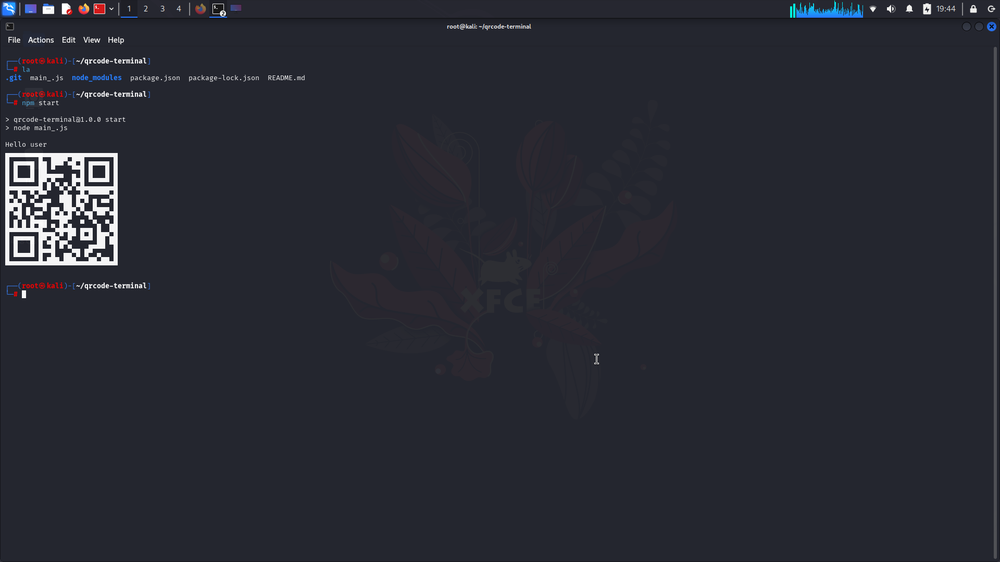

  
  
# Qrcode-Terminal

## 🐞 View source - [Cod main_.js](https://github.com/trezhywinks/qrcode-terminal/blob/main/main_.js)

```ts
const qrcode = require('qrcode-terminal');
const host = 'https://github.com/trezhywinks/';

qrcode.generate(host, {small: true}, function(qrcode) {
console.log(qrcode);
})
```
## Commands
```
sudo apt update
```
```
$ git clone https://github.com/trezhywinks/qrcode-terminal.git
$ cd qrcode-terminal
$ npm install .
```

## Screenshot


